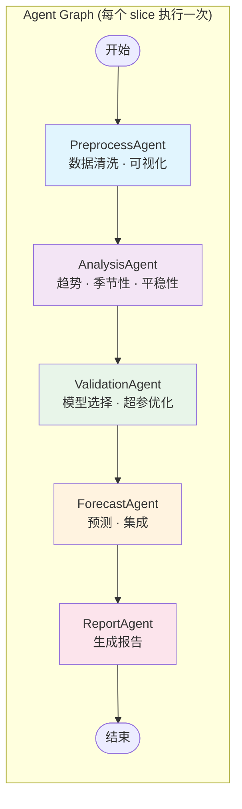
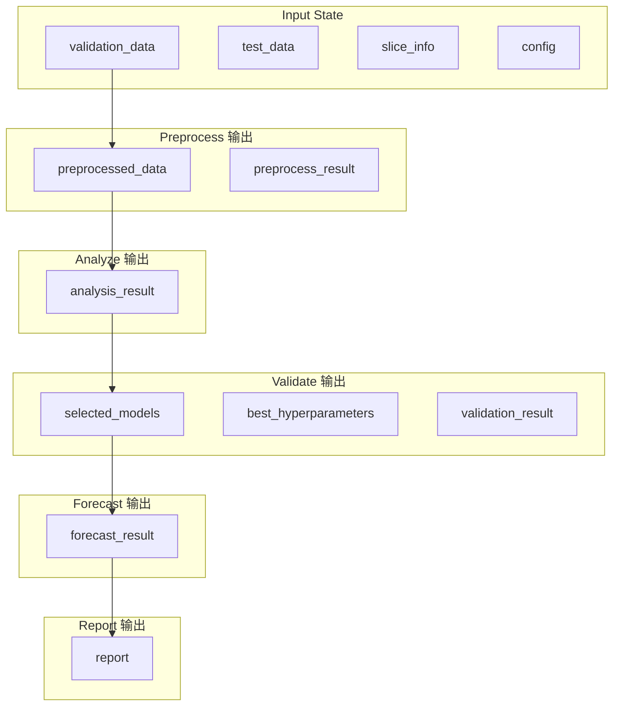
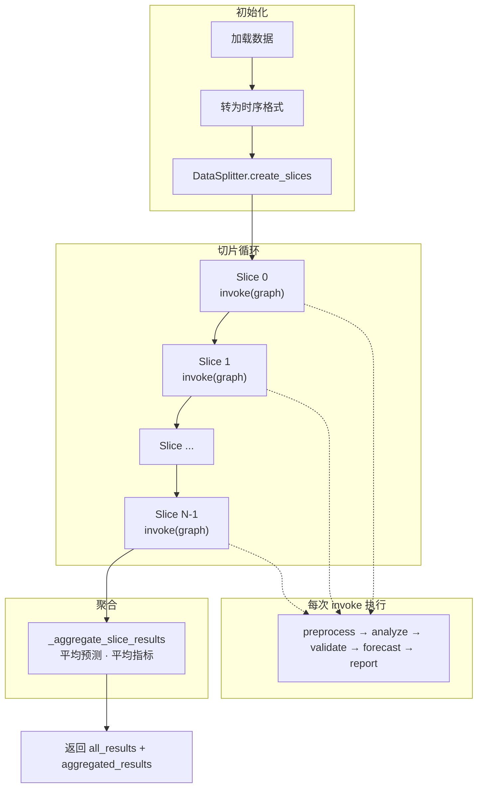

# TimeSeriesScientist Agent Graph

## LangGraph 单切片工作流

## State 数据流

## 完整 run() 流程（含切片循环与聚合）

## 节点职责速查

| 节点 | Agent | 输入 | 输出 |
|------|-------|------|------|
| preprocess | PreprocessAgent | validation_data | preprocessed_data, preprocess_result |
| analyze | AnalysisAgent | preprocessed_data, visualizations | analysis_result |
| validate | ValidationAgent | analysis_result, available_models, preprocessed_data | validation_result, selected_models, best_hyperparameters |
| forecast | ForecastAgent | selected_models, best_hyperparameters, test_data | forecast_result |
| report | ReportAgent | experiment_summary | report |
